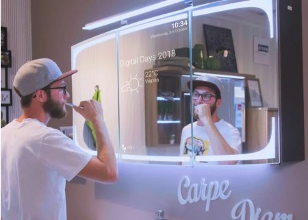

<p align="center">
  
</p>

<h1 align="center">🪞 AI Mirror: Real-Time Emotion Analyzer</h1>

<p align="center">
  <b>Voice and text-based emotion detection powered by AI</b>
</p>

<p align="center">
  
  
  
  
</p>

---

## 🔍 Overview

> AI Mirror is an AI-powered emotion analysis app that listens to your **voice** or reads your **text**, and instantly reflects your emotional state using advanced deep learning models. 

---

## 🎯 Features

- 🎤 **Voice Emotion Detection**
  - Real-time recording with waveform display
  - In-browser audio analysis via `wav2vec2` from HuggingFace
- 💬 **Text Emotion Detection**
  - Analyze emotional tone of any typed message
- 🔁 **Playback Functionality**
  - Listen to your recorded message before submission
- ⚡ **Live Feedback UI**
  - Beautiful React interface with waveform animation

---

## 🖼️ Screenshots

### 🎙 Voice Analysis
<p align="center">
  
</p>

### 💬 Text Emotion Detection
<p align="center">
  
</p>

---

## 🧰 Tech Stack

| Frontend | Backend | Models |
|----------|---------|--------|
|  React.js |  Flask | 🤖 `wav2vec2` |
| 🎙 `react-mic` | 🔁 `Flask-CORS` | ✍️ `DistilBERT` |
| ⚡ `axios` | 🔊 `torchaudio`, `pydub` | 🧠 HuggingFace Transformers |

---

## ⚙️ Setup Instructions

### 🔃 Clone the Repo
```bash
git clone https://github.com/yourusername/ai-mirror.git
cd ai-mirror
```

### 2. Backend Directory
```bash
cd backend
python -m venv env
env\Scripts\activate   # On Windows
pip install -r requirements.txt
python app.py
```

### 3. Frontend Setup
```bash
cd ../frontend
npm install
npm start
```
###
